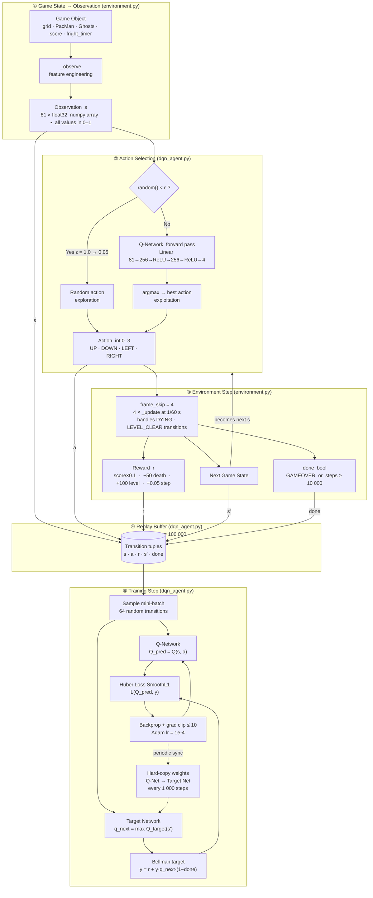

# PAC-MAN DQN Player

This repository preserves the original **Atari Pac-Man** 6502 assembly source code developed by **Roklan Corp** for Atari Inc. (Revision 3.0, 10/03/82), together with a faithful **Python translation** into a playable modern game and a **Deep Q-Network (DQN) reinforcement-learning agent** that learns to play from scratch — no hard-coded rules, only the raw game signal. The project combines historical software preservation, a hands-on study of classic ghost-personality AI, and a practical demonstration of why a seemingly simple arcade game is a surprisingly hard reinforcement-learning problem (10 million gradient steps and 18 hours of CPU training to reach 77 % maze completion).

**Main technologies:** Python · pygame · PyTorch (DQN reinforcement learning) · NumPy · 6502 assembly (original Atari source)

**Monthly cost:** $0. The project runs entirely on your local machine with no cloud services, no APIs, and no paid libraries. Training the DQN agent requires only a CPU (~18 hours for 10 300 episodes) or a GPU for faster results.

---

## Table of Contents

1. [The Story of Pac-Man](#the-story-of-pac-man)
2. [Repository Contents](#repository-contents)
   - [Atari Version — Roklan Corp](#atari-version--roklan-corp-revision-30)
   - [Python Version](#python-version)
3. [Screenshots](#screenshots)
4. [Running the Python Version](#running-the-python-version)
5. [AI Player — Deep Q-Network (DQN)](#ai-player--deep-q-network-dqn)
   - [Libraries Used](#libraries-used)
   - [Data Processing Pipeline](#data-processing-pipeline)
   - [Data Flow Diagram](#data-flow-diagram)
   - [The DQN Model — Design Rationale](#the-dqn-model--design-rationale)
   - [Training the Agent](#training-the-agent)
   - [Watching the Agent Play](#watching-the-agent-play)
   - [Training Results](#training-results--full-10-300-episode-campaign)
6. [Training Journey Summary](#training-journey-summary)
7. [Upstream Repository](#upstream-repository)
8. [License](#license)

---

## The Story of Pac-Man

The history of Pac-Man begins not with a joystick, but with a pizza.

In 1979, **Toru Iwatani**, a game designer at Namco, was looking for a concept that would break the mold of space shooters and war games that dominated arcades. Staring at a pizza missing one slice, the image clicked: a round, chomping character navigating a maze. His goal was deliberate — create a game welcoming to everyone, not just the usual young male arcade crowd.

**May 1980** — Pac-Man launches in Japanese arcades under the name *Puck-Man* (パックマン). The name was changed to *Pac-Man* for the North American release to prevent obvious vandalism of the cabinet lettering. The concept is deceptively simple: guide Pac-Man through a maze, eat all the dots, dodge four colorful ghosts — Blinky, Pinky, Inky, and Clyde — and use power pellets to briefly turn the tables on your pursuers.

The game spreads like wildfire. By 1981, **Pac-Man Fever** — a literal pop song by Buckner & Garcia — hits the charts. The character appears on lunchboxes, Saturday morning cartoons, board games, and clothing. Pac-Man becomes the first video game character to cross into mainstream popular culture.

**1982** — Atari licenses Pac-Man for its home consoles. Roklan Corp is contracted to develop the Atari 5200 version, producing a port far more faithful to the arcade original than the infamous Atari 2600 release. The source code preserved here — `REVISION 3.0, 10/03/82` — is that very work: six 6502 assembly files, hand-crafted by the Roklan team under strict confidentiality.

Spin-offs follow: *Ms. Pac-Man* (1982) becomes one of the best-selling arcade games ever made, joined by *Super Pac-Man*, *Pac-Land*, *Pac-Mania*, and eventually *Pac-Man Championship Edition*. The franchise never truly went away. Decades later, Pac-Man's silhouette needs no introduction — the "waka-waka" sound is as recognizable as a dial tone.

---

## Repository Contents

```
Pacman/
├── Atari_version/          # Original 6502 assembly source (Roklan Corp, 1982)
│   ├── PACMAN.ASM          # Main game loop, option/attract mode, DLI/VBI
│   ├── PAC1.ASM            # VBlank subroutines: attract, collision, death
│   ├── PAC2.ASM            # Rerack/level-clear, ready sequence
│   ├── PAC3.ASM            # Pac-Man movement (PMSTIK), dot eating (MUNCHY), scoring
│   ├── PAC4.ASM            # Ghost AI: MONSTR / MCHASE / GOHOME / MDIRCT / EYONLY
│   ├── PACDAT1.ASM         # Maze tile data (DATMAZ)
│   ├── PACDAT2.ASM         # Sprite / animation data
│   ├── PACDAT3.ASM         # Additional data tables
│   ├── ATARISYS.ASM        # Atari system definitions
│   └── SYSTEXT.ASM         # Text / display routines
│
├── Python_version/
│   ├── pacman.py           # Python translation of the full assembly codebase
│   ├── requirements.txt    # pygame >= 2.0.0
│   └── take_screenshots.py # headless renderer used to generate screenshots/
│
├── AI_player/
│   ├── environment.py      # gym-style headless wrapper around pacman.py
│   ├── dqn_agent.py        # QNetwork, ReplayBuffer, DQNAgent
│   ├── train.py            # training loop with checkpointing
│   ├── play.py             # watch a saved model play
│   └── requirements.txt    # torch >= 2.0, numpy, pygame
│
└── screenshots/            # rendered gameplay stills
```

### Atari Version — Roklan Corp (Revision 3.0)

The assembly source is annotated with original Roklan labels and register names (e.g., `PMHPOS`, `PMVPOS`, `COLPF2`, `DLICNT`). The header in `PACMAN.ASM` reads:

```
; PAC-MAN
; Developed for Atari Inc. by Roklan Corp.
; This information is confidential and is not for sale or distribution.
; 10/03/82 — DISK VERSION — REVISION 3.0
```

The code targets the **Atari 5200** hardware, exploiting its custom chips — ANTIC (display list), GTIA (sprites/color registers), and POKEY (sound/input) — to produce a close arcade replica. The six `PAC*.ASM` files map directly to the game's functional modules, with `PACDAT*.ASM` holding all static table data.

### Python Version

`pacman.py` is a line-by-line conceptual translation of the assembly into Python + **pygame**, written to be readable alongside the original source. Every class, method, and constant references its assembly counterpart:

| Assembly file | Python equivalent |
|---|---|
| `PACMAN.ASM` | `Game` class (main loop, state machine) |
| `PAC1.ASM` | `Game._update_*` (VBlank subroutines) |
| `PAC2.ASM` | `Game._check_*` (level-clear, ready sequence) |
| `PAC3.ASM` | `PacMan` class (movement, dot eating, scoring) |
| `PAC4.ASM` | `Ghost` class (MONSTR AI, chase/scatter/fright/eaten) |
| `PACDAT1.ASM` | `MAZE_DEF` (28×31 tile grid) |

Ghost AI faithfully reproduces the four classic personalities:
- **Blinky** — direct pursuit (always targets Pac-Man's current tile)
- **Pinky** — ambush (targets 4 tiles ahead of Pac-Man)
- **Inky** — flanking (2-tile lookahead reflected around Blinky)
- **Clyde** — shy (chases when far, retreats to corner when within 8 tiles)

---

## Screenshots

| Ready Screen | Gameplay |
|:---:|:---:|
|  |  |

| Frightened Ghosts | Death Animation |
|:---:|:---:|
|  |  |

| Game Over |
|:---:|
|  |

---

## Running the Python Version

**Requirements:** Python 3.8+, pygame

```bash
pip install -r Python_version/requirements.txt
python Python_version/pacman.py
```

### Controls

| Key | Action |
|---|---|
| Arrow keys / WASD | Move Pac-Man |
| P | Pause / Resume |
| Q / Esc | Quit |
| Enter | New game (on Game Over screen) |

---

## AI Player — Deep Q-Network (DQN)

The `AI_player/` folder contains a reinforcement learning agent that learns to play Pac-Man from scratch — no hard-coded rules, only the raw game signal.

---

### Libraries Used

| Library | Version | Role in this project |
|---|---|---|
| **PyTorch** (`torch`) | ≥ 2.0 | Defines and trains the neural network. Provides `nn.Module`, `nn.Linear`, `nn.SmoothL1Loss`, the `Adam` optimiser, automatic differentiation, and optional GPU acceleration via CUDA. |
| **NumPy** (`numpy`) | ≥ 1.24 | Builds the observation vector as a `float32` array, stacks replay-buffer samples into batches before handing them to PyTorch, and computes running-average statistics for logging. |
| **pygame** | ≥ 2.0 | Runs the game simulation. In training mode it drives an offscreen SDL surface (no window); in play mode it renders the full 448 × 568 game window at 60 FPS. |

> **Note on other AI technologies** — this project uses classic **Reinforcement Learning** only. Generative AI, large language models (LLMs), retrieval-augmented generation (RAG), speech-to-text, image diffusion, image classification, and chatbot frameworks are **not** used here because they solve fundamentally different problems (content generation, language understanding, audio transcription, pixel synthesis, supervised recognition, conversational interfaces). RL is the natural fit when an agent must learn a sequential decision policy purely through trial-and-error interaction with an environment.

---

### Data Processing Pipeline

The pipeline runs one full cycle every agent step (4 game frames):

**Step 1 — Raw game state**
The `Game` object from `pacman.py` holds the authoritative state: the 28 × 31 tile grid, Pac-Man's pixel position and direction, each ghost's position, AI state, and fright timer, plus the current score and remaining dots.

**Step 2 — Feature engineering (`_observe`)**
The raw state is converted into a fixed-length **81-dimensional `float32` numpy array** so PyTorch can process it. All values are normalised to `[0, 1]`:

| Slice | Size | Content |
|---|---|---|
| `[0:2]` | 2 | Pac-Man column and row ÷ grid dimensions |
| `[2:6]` | 4 | Pac-Man direction one-hot (UP / DOWN / LEFT / RIGHT) |
| `[6:30]` | 4 × 6 | Per ghost: col, row, is\_frightened, is\_eaten, is\_inactive, Manhattan distance to Pac-Man |
| `[30]` | 1 | Fright timer ÷ fright\_total |
| `[31]` | 1 | Dots remaining ÷ 244 (total dots) |
| `[32:81]` | 49 | 7 × 7 tile grid centred on Pac-Man — cell type ÷ 5 |

**Step 3 — Action selection (ε-greedy)**
The observation is fed to the Q-network, which outputs one Q-value per action (4 values). The agent picks the action with the highest Q-value (`argmax`) — or, with probability ε, a random action. ε starts at 1.0 (fully random) and decays linearly to 0.05 over 200 000 steps, balancing exploration vs. exploitation.

**Step 4 — Environment step**
The chosen action (direction) is applied to the game. The simulation runs 4 frames (`frame_skip = 4`) to reduce temporal correlation between observations, matching the approach from the original Atari DQN paper. State transitions (death, level clear) are handled transparently and translated into reward signals.

**Step 5 — Reward shaping**
The reward at each step combines:
- Scaled game score: `(score_after − score_before) × 0.1`
- Death penalty: `−50.0`
- Level-clear bonus: `+100.0`
- Per-step cost: `−0.05` (discourages idling)

| Game event | Reward |
|---|---|
| Eating a dot | +1.0 |
| Eating a power pellet | +5.0 |
| Eating a ghost (chain) | +20 / +40 / +80 / +160 |
| Dying | −50.0 |
| Clearing a level | +100.0 |
| Each step | −0.05 |

**Step 6 — Replay buffer**
The transition `(s, a, r, s', done)` is pushed into a `collections.deque` capped at 100 000 entries. Storing past transitions and sampling them randomly breaks the temporal correlations that would otherwise destabilise training.

**Step 7 — Mini-batch sampling & training**
Once the buffer holds at least 64 transitions, a random mini-batch is drawn and converted to PyTorch tensors. The Q-network predicts `Q(s, a)` for each sample; the frozen target network predicts `max Q(s', a')` to form the Bellman target `y = r + γ · max Q(s') · (1 − done)`. Huber loss between prediction and target is backpropagated through the Q-network via Adam. The target network weights are hard-copied from the Q-network every 1 000 steps.

---

### Data Flow Diagram



---

### The DQN Model — Design Rationale

**Why Reinforcement Learning, not supervised learning?**
There is no dataset of "correct moves" to learn from. The agent must discover strategies — when to flee, when to hunt, which dots to prioritise — purely through interaction. RL formalises this as a Markov Decision Process: the agent takes actions, the environment returns rewards, and the goal is to maximise cumulative discounted reward over time.

**Why DQN specifically?**
DQN (Mnih et al., *Nature* 2015) was chosen because:
- Pac-Man has a **small discrete action space** (4 directions), making Q-value enumeration cheap.
- The game state can be encoded as a **compact feature vector** (81 floats), so pixel-based convolutional approaches (used in the original DeepMind work) are unnecessary.
- DQN is **sample-efficient** relative to policy-gradient methods (PPO, A3C) at this problem scale.
- The two stabilising innovations — **experience replay** and a **target network** — make training robust without requiring distributed rollouts.

No generative, language, or vision-foundation models are involved; the problem does not call for them.

**Key strengths of the configuration**

| Design choice | Rationale |
|---|---|
| **Replay buffer 100 k** | Large enough to break temporal correlations; small enough to fit in CPU RAM. |
| **Frame skip = 4** | Reduces effective decision frequency so each action has time to have a visible effect; matches the Atari DQN paper. |
| **Target network, hard sync every 1 000 steps** | Provides stable regression targets; prevents the oscillation caused by chasing a moving target. |
| **Huber loss (SmoothL1)** | Less sensitive to outliers than MSE — important when rare events (eating 4 ghosts in a chain) produce large Q-value spikes. |
| **Gradient clipping ≤ 10** | Prevents exploding gradients from reward spikes. |
| **γ = 0.99** | High discount favours long-term planning (clearing levels) over myopic dot-chasing. |
| **ε-greedy linear decay 1.0 → 0.05 over 200 k steps** | Ensures thorough early exploration of the maze before exploitation begins. 5 % residual randomness prevents policy collapse on local optima. |
| **Adam lr = 1e-4** | Conservative learning rate for stable convergence; lower than default (3e-4) to account for non-stationary targets. |

**Network architecture**

```
Input (81)
    │
Linear(256) → ReLU
    │
Linear(256) → ReLU
    │
Linear(4)   →  Q-values for [UP, DOWN, LEFT, RIGHT]
```

Two hidden layers of 256 units provide enough capacity to represent ghost-avoidance and dot-collection strategies simultaneously without overfitting on the 81-feature input.

---

### Training the agent

```bash
pip install -r AI_player/requirements.txt
python AI_player/train.py --episodes 5000
```

Resume from a checkpoint:

```bash
python AI_player/train.py --episodes 10000 --load AI_player/checkpoints/dqn_ep5000.pt
```

Progress is printed every 100 episodes. Checkpoints land in `AI_player/checkpoints/`; the best model (highest mean score over the last 100 episodes) is saved as `dqn_best.pt`.

### Watching the agent play

```bash
python AI_player/play.py --model AI_player/checkpoints/dqn_best.pt
```

Add `--headless` to benchmark without opening a window:

```bash
python AI_player/play.py --model AI_player/checkpoints/dqn_best.pt --headless --episodes 20
```

### Learning curve

| Training stage | Typical behaviour |
|---|---|
| 0 – 1 000 eps | Random movement, dies quickly |
| 1 000 – 5 000 eps | Learns to collect dots, avoids most ghosts |
| 5 000 – 20 000 eps | Uses power pellets strategically, hunts frightened ghosts |
| 20 000+ eps | Consistent multi-level runs |

---

### Training Results — Full 10 300-Episode Campaign

Three successive training runs on a single CPU totalling **10 300 episodes** and **~18 hours** of wall-clock time. All 13 checkpoints were evaluated over 60 games each.

#### Key statistics

| Checkpoint | Mean score | Dots eaten | Maze % | Success rate |
|:---:|---:|---:|---:|---:|
| ep 100 | 852 | 76 / 244 | 31 % | 5 % |
| ep 200 | 1 358 | 115 / 244 | 47 % | 72 % |
| ep 300 | 1 642 | 139 / 244 | 57 % | 85 % |
| ep 1 300 | 2 472 | 191 / 244 | 78 % | **100 %** |
| ep 2 300 | 2 383 | 187 / 244 | 77 % | **100 %** |
| ep 3 300 | 2 433 | 187 / 244 | 77 % | **100 %** |
| ep 4 300 | 2 395 | 186 / 244 | 76 % | **100 %** |
| ep 5 300 | 2 454 | 189 / 244 | 77 % | 98 % |
| ep 6 300 | **2 585** | **193 / 244** | **79 %** | **100 %** |
| ep 7 300 | 2 429 | 189 / 244 | 77 % | **100 %** |
| ep 8 300 | 2 213 | 176 / 244 | 72 % | 93 % |
| ep 9 300 | 2 007 | 158 / 244 | 65 % | 83 % |
| ep 10 300 | 2 400 | 184 / 244 | 75 % | **100 %** |

> **Success** = scoring ≥ 1 200 points per episode (≈ 120 dots eaten).  
> Peak performance reached at **ep 6 300** (score 2 585, 79 % maze). A temporary dip at ep 8 300–9 300 reflects natural DQN oscillation before recovery.

#### Score progression


#### Maze completion — dots eaten


#### Time to solve the labyrinth

Steps to reach the 1 200-point milestone (left) and hit rate per checkpoint (right).


#### Successes and failures


#### Policy evolution

Game snapshots every 500 episodes showing the maze emptying progressively as the policy matures.


---

## Training Journey Summary

### Execution statistics

| Run | Episodes | Wall time | Best score | Notes |
|:---:|:---:|---:|---:|---|
| Run 1 | 300 | 21 min | 2 160 | ε decayed 1.0 → 0.05; buffer filled |
| Run 2 | 5 000 | 478 min | 4 310 | Resumed from ep 300; ε = 0.05 fixed |
| Run 3 | 5 000 | 590 min | 5 110 | Resumed from ep 5 300; ε = 0.05 fixed |
| **Total** | **10 300** | **~18.1 hours** | **5 110** | Single CPU, no GPU |

| Metric | Value |
|---|---|
| Total gradient steps | ~10.7 million |
| Replay buffer capacity | 100 000 transitions |
| Neural network parameters | ~145 000 weights |
| Peak mean score (eval) | 2 585 at ep 6 300 |
| Peak single-game score | 5 110 |
| Best maze completion | 79 % of 244 dots |
| Full level clears achieved | 0 |
| Hardware | CPU only (~320 % utilisation, 4 cores) |

---

### Why does a "simple" game like Pac-Man demand so much computation?

Pac-Man looks trivial to a human: eat dots, dodge ghosts. A child learns it in minutes. Yet 18 hours of CPU training produced an agent that still cannot reliably clear a single level. The gap between human learning and gradient descent reveals seven deep challenges in reinforcement learning.

#### 1. The state space is astronomically large

The maze has ~240 walkable cells. Pac-Man can occupy any of them, facing any of 4 directions. Each of 4 ghosts can be on any tile in any AI state (chase, scatter, frightened, eaten). The dot configuration alone has 2²⁴⁴ possible patterns. Even with the compact 81-feature observation, the agent must generalise across a state space it can never fully explore. A human instantly recognises "ghost approaching from the left — flee right" regardless of exact tile; the network must learn this from thousands of raw examples.

#### 2. Rewards are sparse and heavily delayed

Each dot eaten gives +1 reward, but collecting all 244 to clear a level takes 400–600 steps. The level-clear bonus (+100) arrives hundreds of decisions after the early navigation choices that made it possible. This is the **credit-assignment problem**: the network must discover which action taken 300 steps ago was responsible for a reward arriving now. Humans solve this with intuitive causal reasoning; DQN must infer it statistically across millions of transitions.

#### 3. Ghosts create a deceptive reward landscape

Blinky chases directly. Pinky ambushes 4 tiles ahead. Inky flanks. Clyde retreats when close. The same tile is worth +1 (safe dot) or −50 (fatal collision) depending on ghost positions, directions, and whether a power pellet was recently eaten. The Q-function must encode this context-sensitivity across the entire maze — a surface so irregular that 145 000 network weights and 10 million gradient steps are barely enough to approximate it.

#### 4. Exploration is genuinely hard

With a random policy, the probability of accidentally eating all 244 dots without dying is negligible. For thousands of early episodes, the level-clear signal never fires, so the network has no gradient signal pointing toward full-maze completion. The ε-greedy schedule provides exploration, but at ε = 0.05 (the floor we reached after run 1), the agent still makes ~1 random move in 20 — enough to occasionally walk into ghosts mid-route.

#### 5. Training targets are non-stationary

Unlike supervised learning (fixed labels), DQN trains against Bellman targets computed from the same network it is updating. Every weight update shifts the target, which can shift the Q-values, which changes the targets again. This feedback loop is inherently unstable and is exactly why the **target network** (frozen for 1 000 steps) and **replay buffer** (breaking temporal correlations) exist. Without them, training diverges. Even with them, oscillations are visible in the ep 8 300–9 300 dip in the evaluation table.

#### 6. The agent has no memory

The network receives a single 81-feature snapshot per step. It cannot remember that a ghost was approaching from the right two steps ago, or that it recently ate a power pellet and the ghosts are now vulnerable. All context must be inferred from the instantaneous observation. A human player unconsciously tracks ghost trajectories and plans several moves ahead; this agent must re-derive everything from a frozen frame.

#### 7. Each episode requires thousands of interactions

A single policy improvement requires: running the game to collect a transition, storing it in the 100k buffer, sampling a 64-transition batch, doing a forward pass (81→256→256→4), computing Huber loss against the target network, backpropagating gradients, and updating weights. This cycle runs once per agent step — roughly **600 cycles per episode**, **10 000 episodes to see meaningful policy improvement**, and **10 million total cycles** to approach the performance plateau. On a CPU this takes ~18 hours; on a modern GPU it would take ~30 minutes.

#### The bottom line

Pac-Man is "simple" for a human because we bring billions of years of evolved spatial reasoning, danger recognition, and planning to the table. We transfer concepts instantly — "moving yellow circle + moving coloured ghost = danger" is obvious to any primate. A DQN starts from random noise. Every behaviour — *flee from Blinky*, *ambush corner from Pinky*, *chase blue ghost*, *prioritise isolated dots* — must be discovered from scratch through trial, error, and gradient descent over millions of interactions. The 18 hours of training here produced an agent that consistently eats ~77 % of the maze. A skilled human clears it in under 90 seconds. That gap is the distance between 10 million gradient steps and cognition.

---

## Upstream Repository

The Atari assembly source is mirrored from:
**[github.com/DillonDepeel/Pacman-Source-Code](https://github.com/DillonDepeel/Pacman-Source-Code)**

That repository collects the original Roklan Corp files as they have circulated among preservation communities, along with the game's history documented in its own `README.md`.

---

## License

See `Atari_version/LICENSE` for the terms covering the original assembly source.
The Python translation is provided for educational and preservation purposes.

---

## Auditing

This section provides a structured checklist for review by an IT expert and a reinforcement-learning / game-AI subject-matter expert.

### Audit Items

- **Cost & resource minimization** — $0. The entire project runs on local hardware. Training the DQN agent requires ~18 hours on a CPU or ~30 minutes on a GPU. No cloud services, APIs, or paid libraries are used.
- **IT architecture** — Clean three-part repository structure (Atari source preservation / Python port / AI player). The `environment.py` gym-style wrapper provides a standard interface between the game and the RL agent. Separation of `train.py`, `play.py`, and `environment.py` follows established RL project conventions.
- **Code efficiency** — The 81-feature vector observation avoids the computational cost of pixel-based CNNs. The replay buffer is capped at 100,000 transitions (fits in CPU RAM). Frame skip=4 reduces the effective decision frequency, matching the original DQN paper's approach. Checkpointing every episode set allows resuming training without loss.
- **Cybersecurity** — No network access, no credentials, no external APIs. Fully self-contained educational project.
- **Readability & maintainability** — Each DQN design choice (buffer size, frame skip, target network sync interval, Huber loss, γ, ε schedule) has a documented rationale. The training results table across 13 checkpoints is transparent and reproducible. Assembly-to-Python mapping table aids cross-referencing.
- **AI / ML model adequacy** — DQN is the correct algorithm for a small discrete-action deterministic environment. Hyperparameters (γ=0.99, lr=1e-4, Huber loss, gradient clipping ≤10) follow established best practices from the original DQN paper. The known ceiling (~79% maze completion) is honestly documented and explained.
- **Reproducibility** — `random_state=42` ensures reproducible training runs. Checkpoint system enables training to be paused and resumed. The training journey (3 runs, 10,300 episodes) is fully documented with wall-clock times.
- **Other** — GPU training is not required but would reduce training time by ~36×. The headless benchmark mode (`--headless`) is useful for automated evaluation. No automated test suite for the game logic or RL environment.

### Summary Table

| Audit Item | Claude's Assessment | Human Expert Assessment |
|---|---|---|
| Cost & resource minimization | $0. Local CPU/GPU only. 18h CPU training is acceptable for an educational project. | |
| IT architecture | Clean three-part structure with gym-style environment wrapper. Follows established RL project conventions. | |
| Code efficiency | 81-feature vector avoids CNN overhead. Replay buffer fits in RAM. Frame skip=4 is correct. | |
| Cybersecurity | No network access or credentials. Self-contained educational project. Minimal risk. | |
| Readability & maintainability | Every hyperparameter choice is justified. Training results are transparent. Assembly-Python mapping is documented. | |
| AI / ML model adequacy | DQN is the right algorithm here. Hyperparameters follow published best practices. Performance ceiling is honestly documented. | |
| Reproducibility | random_state=42 + checkpoint system ensures reproducible, resumable training. | |
| Other | GPU support would accelerate training significantly. No automated test suite for game logic or RL environment. | |
